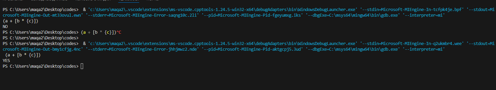
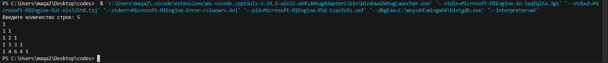
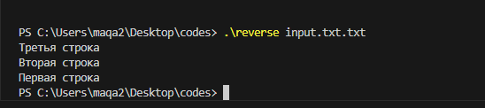
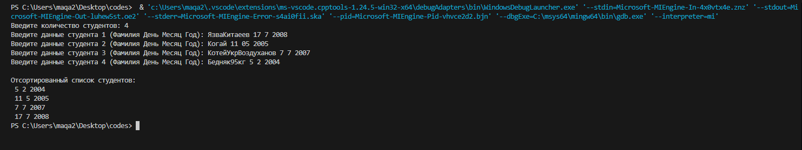

# Программирование - Язык C. Сдача автоматом

## Задача 1 - Проверка сбалансированности скобок в выражении

### Постановка задачи
 Напишите программу для проверки корректности расстановки круглых, фигурных и квадратных скобок в заданной строке. 
 • Вход. Строка с выражением, содержащим скобки (может включать и другие символы). 
 • Выход. Вывести YES, если все типы скобок в строке корректно сбалансированы, или NO – если допущена ошибка в порядке скобок. 
 • Требования. Для проверки использовать стек. Алгоритм должен учитывать соответствие типов скобок (например, \[ соответствует ]) и их порядок вложенности. Программа игнорирует несвязанные символы и анализирует только скобки. При обнаружении несбалансированной скобочной структуры обработать ситуацию и вывести NO. Использование стека должно быть реализовано вручную (например, через массив или связный список), без использования сторонних коллекций.
 
## Список идентификаторов

| Идентификатор   | Тип данных       | Описание                                                                 |
|----------------|------------------|--------------------------------------------------------------------------|
| `MAX_SIZE`     | `const int`      | Максимальный размер стека (константа)                                   |
| `stack`        | `char[MAX_SIZE]` | Массив, реализующий стек для хранения скобок                            |
| `top`          | `int`            | Индекс вершины стека (изначально -1)                                    |
| `push`         | `void(char)`     | Функция добавления символа в стек                                       |
| `pop`          | `char()`         | Функция извлечения символа из стека                                     |
| `is_balanced`  | `bool(const char*)` | Функция проверки баланса скобок в строке                               |
| `str`          | `char[MAX_SIZE]` | Входная строка для проверки                                             |
| `main`         | `int()`          | Главная функция программы                                               |

### Код программы
```c
#include <stdio.h>
#include <stdbool.h>

#define MAX_SIZE 1000

char stack[MAX_SIZE];
int top = -1;

void push(char c) {
    if (top < MAX_SIZE - 1) {
        stack[++top] = c;
    }
}

char pop() {
    if (top >= 0) {
        return stack[top--];
    }
    return '\0';
}

bool is_balanced(const char* str) {
    for (int i = 0; str[i] != '\0'; i++) {
        char c = str[i];
        if (c == '(' || c == '[' || c == '{') {
            push(c);
        } else if (c == ')' || c == ']' || c == '}') {
            char open = pop();
            if ((c == ')' && open != '(') ||
                (c == ']' && open != '[') ||
                (c == '}' && open != '{')) {
                return false;
            }
        }
    }
    return top == -1;
}

int main() {
    char str[MAX_SIZE];
    fgets(str, MAX_SIZE, stdin);
    printf(is_balanced(str) ? "YES\n" : "NO\n");
    return 0;
}
```

**Результат программы**



## Задача 2 - Генерация треугольника Паскаля
### Постановка задачи
Напишите программу, которая выводит первые N строк треугольника Паскаля. 
• Вход. Целое число N – количество требуемых строк треугольника Паскаля. 
• Выход. N строк, каждая из которых содержит соответствующие коэффициенты треугольника Паскаля, разделённые пробелами. 
• Требования. Для хранения каждой строки треугольника динамически выделять массив соответствующего размера. Не использовать фиксированные размерности массивов, расчёт должен работать для любого N разумного размера. После генерации всех строк освободить всю выделенную память (не допускать утечки памяти).


## Список идентификаторов для генератора треугольника Паскаля

| Идентификатор | Тип данных | Описание |
|--------------|-----------|----------|
| `n` | `int` | Количество строк треугольника (входной параметр) |
| `triangle` | `int**` | Двумерный массив для хранения треугольника |
| `i` | `int` | Счётчик строк (внешний цикл) |
| `j` | `int` | Счётчик элементов в строке (внутренний цикл) |

### Код программы
```c

#include <stdio.h>
#include <stdlib.h>

int main() {
    int n;
    printf("Введите количество строк: ");
    scanf("%d", &n);

    // Выделение памяти для треугольника
    int **triangle = (int **)malloc(n * sizeof(int *));
    for (int i = 0; i < n; i++) {
        triangle[i] = (int *)malloc((i + 1) * sizeof(int));
        triangle[i][0] = 1;  // Первый элемент всегда 1

        for (int j = 1; j < i; j++) {
            triangle[i][j] = triangle[i-1][j-1] + triangle[i-1][j];
        }
        triangle[i][i] = 1;  // Последний элемент всегда 1
    }

    // Вывод треугольника
    for (int i = 0; i < n; i++) {
        for (int j = 0; j <= i; j++) {
            printf("%d ", triangle[i][j]);
        }
        printf("\n");
    }

    // Освобождение памяти
    for (int i = 0; i < n; i++) {
        free(triangle[i]);
    }
    free(triangle);

    return 0;
}
```
**Результат программы**

## Задача 3 - Реверс строк файла

### Постановка задачи
Напишите программу, которая считывает текстовый файл и выводит его строки в обратном порядке.
• Вход. Имя текстового файла задаётся в командной строке. 
• Выход. Все строки исходного файла, выведенные в обратном порядке. Каждая строка исходного файла становится отдельной строкой вывода, но порядок строк обращается (последняя строка входного файла становится первой строкой вывода и т.д.). 
• Требования. Считать все строки файла в память, сохраняя их в списке (например, в массиве указателей на строки, размер которого увеличивается по мере необходимости). 
После чтения файла программа не производит дополнительных операций ввода-вывода, а просто выводит ранее сохранённые строки в обратном порядке. Желательно учитывать объём файла: для очень больших файлов можно рассмотреть чтение построчно с записью на диск, однако минимальное решение – считывание целиком – допустимо, если объём файла помещается в оперативную память. Не забыть освободить выделенную память для хранения строк после формирования вывода.

## Список идентификаторов 

| Идентификатор | Тип данных | Описание |
|--------------|-----------|----------|
| `INITIAL_CAPACITY` | `#define` | Начальный размер массива строк |
| `argc` | `int` | Количество аргументов командной строки |
| `argv` | `char**` | Аргументы командной строки |
| `file` | `FILE*` | Указатель на файловый поток |
| `lines` | `char**` | Массив строк (для хранения содержимого файла) |
| `capacity` | `size_t` | Текущая ёмкость массива строк |
| `count` | `size_t` | Количество считанных строк |
| `line` | `char*` | Буфер для чтения строки |
| `len` | `size_t` | Длина буфера |
| `read` | `ssize_t` | Результат чтения строки |

### Код программы
```c
#include <stdio.h>
#include <stdlib.h>
#include <string.h>
#define INITIAL_CAPACITY 10
int main(int argc, char *argv[]) {
    if (argc != 2) {
        fprintf(stderr, "Использование: %s <имя_файла>\n", argv[0]);
        return 1;
    }
    FILE *file = fopen(argv[1], "r");
    if (!file) {
        perror("Ошибка открытия файла");
        return 1;
    }
    char **lines = malloc(INITIAL_CAPACITY * sizeof(char *));
    size_t capacity = INITIAL_CAPACITY;
    size_t count = 0;
    char *line = NULL;
    size_t len = 0;
    ssize_t read;

    while ((read = getline(&line, &len, file)) != -1) {
        if (count >= capacity) {
            capacity *= 2;
            lines = realloc(lines, capacity * sizeof(char *));
        }
        lines[count++] = strdup(line);
    }
    free(line);
    fclose(file);
    for (size_t i = count; i > 0; i--) {
        printf("%s", lines[i-1]);
    }
    for (size_t i = 0; i < count; i++) {
        free(lines[i]);
    }
    free(lines);
    return 0;
}
```
**Результат программы**

## Задача 4 - Сортировка записей студентов по дате рождения

### Постановка задачи
Напишите программу для сортировки списка студентов по возрастанию даты рождения. 
• Вход. Сначала задаётся целое число N – количество студентов. Далее следует N строк, каждая из которых содержит данные одного студента: фамилия (одно слово без пробелов), день, месяц и год рождения (целые числа). Пример строки: Иванов 5 10 2000. 
• Выход. N строк с данными студентов, упорядоченными по дате рождения от самой ранней (самый возрастной студент) к самой поздней (самый молодой). Формат каждой строки вывода тот же, что во входных данных: фамилия день месяц год. 
• Требования. Для хранения данных о студенте использовать структуру Student с полями-фамилией (строка) и вложенной структурой Date (с полями день, месяц, год). Считать входные данные в динамически выделенный массив структур Student размером N. Реализовать функцию сравнения двух дат, чтобы определить порядок сортировки. Допускается использовать стандартную функцию сортировки qsort (с собственной функцией-компаратор для структур Student) либо написать алгоритм сортировки вручную. Главное – корректно выполнить сортировку по трем значениям (год, месяц, день). При выводе данных сохранить исходный формат. После завершения работы освободить память, выделенную под массив студентов. Учесть граничные случаи: N = 0 (нет студентов, можно сразу завершить работу программы), совпадение дат рождения (при совпадении дат двух студентов их относительный порядок может остаться как во входных данных, либо можно дополнительно сортировать по фамилии для детерминированности – на ваше усмотрение)

## Список идентификаторов 

### Структуры данных
| Идентификатор | Тип | Описание |
|--------------|------|----------|
| `Date` | `struct` | Хранит дату (день, месяц, год) |
| `Student` | `struct` | Хранит данные студента (фамилия и дата рождения) |

### Переменные
| Идентификатор | Тип | Описание |
|--------------|------|----------|
| `n` | `int` | Количество студентов |
| `students` | `Student*` | Указатель на массив структур Student |
| `i` | `int` | Счетчик в циклах |

### Функции
| Идентификатор | Параметры | Возвращаемое значение | Описание |
|--------------|-----------|----------------------|----------|
| `compare_students` | `const void* a`, `const void* b` | `int` | Функция сравнения для qsort |
| `main` | нет | `int` | Главная функция программы |

### Поля структур
| Структура | Поле | Тип | Описание |
|----------|------|------|----------|
| `Date` | `day` | `int` | День рождения |
| `Date` | `month` | `int` | Месяц рождения |
| `Date` | `year` | `int` | Год рождения |
| `Student` | `surname` | `char[50]` | Фамилия студента |
| `Student` | `birth_date` | `Date` | Дата рождения студента |

### Код программы
```c
#include <stdio.h>
#include <stdlib.h>
#include <string.h>

// Структура для хранения даты
typedef struct {
    int day;
    int month;
    int year;
} Date;
// Структура для хранения данных студента
typedef struct {
    char surname[50];
    Date birth_date;
} Student;
// Функция сравнения для qsort
int compare_students(const void *a, const void *b) {
    const Student *student_a = (const Student *)a;
    const Student *student_b = (const Student *)b;
    
    // Сначала сравниваем годы
    if (student_a->birth_date.year != student_b->birth_date.year) {
        return student_a->birth_date.year - student_b->birth_date.year;
    }
    // Если годы равны, сравниваем месяцы
    if (student_a->birth_date.month != student_b->birth_date.month) {
        return student_a->birth_date.month - student_b->birth_date.month;
    }
    // Если и месяцы равны, сравниваем дни
    if (student_a->birth_date.day != student_b->birth_date.day) {
        return student_a->birth_date.day - student_b->birth_date.day;
    }
    // Если даты полностью совпадают, можно отсортировать по фамилии
    return strcmp(student_a->surname, student_b->surname);
}

int main() {
    int n;
    printf("Введите количество студентов: ");
    scanf("%d", &n);
    
    if (n <= 0) {
        printf("Нет студентов для сортировки.\n");
        return 0;
    }
    // Выделяем память под массив студентов
    Student *students = (Student *)malloc(n * sizeof(Student));
    if (!students) {
        printf("Ошибка выделения памяти.\n");
        return 1;
    }
    // Ввод данных студентов
    for (int i = 0; i < n; i++) {
        printf("Введите данные студента %d (Фамилия День Месяц Год): ", i + 1);
        scanf("%49s %d %d %d", 
              students[i].surname,
              &students[i].birth_date.day,
              &students[i].birth_date.month,
              &students[i].birth_date.year);
    }

    // Сортировка студентов
    qsort(students, n, sizeof(Student), compare_students);

    // Вывод отсортированного списка
    printf("\nОтсортированный список студентов:\n");
    for (int i = 0; i < n; i++) {
        printf("%s %d %d %d\n", 
               students[i].surname,
               students[i].birth_date.day,
               students[i].birth_date.month,
               students[i].birth_date.year);
    }

    // Освобождение памяти
    free(students);
    
    return 0;
}
```
**Результат программы**
