**Лабораторная работа 1. Задачи**

**Задача 1.2**

**1.2** Написать простую программу. Ввести два числа с клавиатуры, вычислить их сумму и напечатать результат. Использовать функцию printf для приглашений на ввод и для распечатки результата. Использовать функцию scanf для ввода каждого числа отдельно с клавиатуры. Для получения доступа к функциям printf и scanf включить в программу заголовочный файл stdio.h. Использовать корректные спецификаторы форматирования. Здесь и далее для распечатки надписей на экране использовать латинские буквы для избежания проблем с кодировками символов.

**Список идентификаторов.**
| Имя переменной | Тип данных | Описание                 |
|----------------|------------|--------------------------|
| num1           | int        | Переменная, первое число |
| num2           | int        | Переменная, второе число |
| sum            | int        | сумма переменных         |

**Код программы**
`#include  <stdio.h>

int main() {

    int num1, num2, sum;
    
    printf("Введи первое число: ");
    
    scanf("%d", \&num1);
    
    printf("Введи второе число: ");
    
    scanf("%d", \&num2);
    
    sum = num1 + num2;
    
   printf("сумма равна %d\n", sum);`
    
    return 0;
}`
**Результат программы**
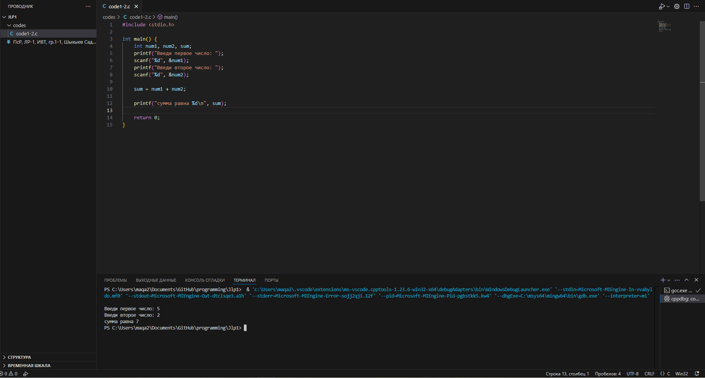

Задача 1.3
Вычислить значение выражения:
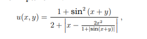
введя x и y с клавиатуры. Подберите значения аргументов x и y самостоятельно за исключением тривиальных значений. Напечатайте вычисленное значение u(x, y) на экране. Включить в программу заголовочный файл math.h для доступа к математическим функциям.

**Список идентификаторов.**

| Имя переменной  | Тип данных | Описание                 |
|-----------------|------------|--------------------------|
| x               | double     | Первая переменная        |
| y               | double     | Вторая переменная        |
| u               | double     | Результат                |
| sin_xy          | double     | Временная переменная     |
| chis            | double     | Числитель выражения      |
| znam            | double     | Знаменатель выражения    |
| abs_term        | double     | Выражение внутри модуля  |

**Код программы**
`\#include \<stdio.h>

\#include \<math.h>

int main() {

    double x, y, u;

    double sin\_xy, chis, znam, abs\_term;

    printf("Введите значение x: ");

    scanf("%lf", \&x);

    printf("Введите значение y: ");

    scanf("%lf", \&y);

    sin\_xy = sin(x + y);

    chis = 1 + pow(sin\_xy, 2);

    abs\_term = x - (2 \* pow(x, 2)) / (1 + fabs(sin\_xy));

    znam = 2 + fabs(abs\_term);

    u = chis / znam;

    printf("Значение u(x, y) = %lf\n", u);

    return 0;

}`

**Результат программы**
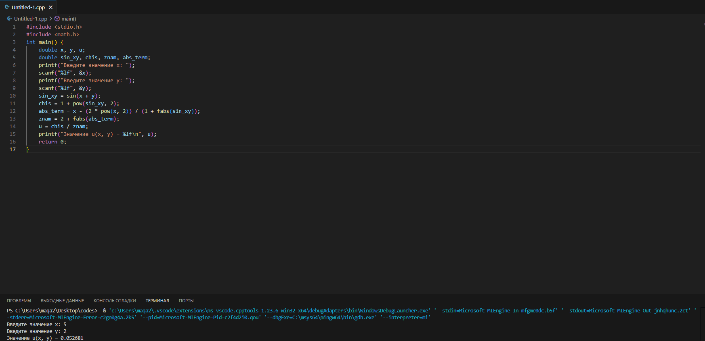

**Задание 1.4**
Вычислить значение выражения:
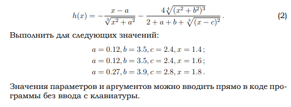
Список идентификаторов:
| Имя переменной | Тип данных | Описание                       |
|----------------|------------|--------------------------------|
| x              | double     | Аргумент функции               |
| a              | double     | Параметр в выражении           |
| b              | double     | Параметр b в выражении         |
| с              | double     | Параметр c в выражении         |
| h(x)           | double     | Результат                      |
| g1             | double     | Первое слагамое                |
| g2             | double     | Второе слагаемое               |
| denominator    | double     | Знаменатель второго слагаемого |

**Код программы**

`#include <stdio.h>
#include <math.h>

double calculate\_h(double x, double a, double b, double c) {
    
    double g1, g2, denominator, h;
    
     g1 = -(x - a) / pow(pow(x, 2) + pow(a, 2), 1.0/3.0);
     
    denominator = 2 + a + b + pow(pow(x - c, 2), 1.0/3.0);
    
    g2 = -4 \* sqrt(pow(pow(x, 2) + pow(b, 2), 3)) / denominator;
    
    h = g1 + g2;
    
    return h;
    
}

int main() {

double a1 = 0.12, b1 = 3.5, c1 = 2.4, x1 = 1.4;

double a2 = 0.12, b2 = 3.5, c2 = 2.4, x2 = 1.6;

double a3 = 0.27, b3 = 3.9, c3 = 2.8, x3 = 1.8;

printf("h(%.2f) = %lf\n", x1, calculate\_h(x1, a1, b1, c1));

printf("h(%.2f) = %lf\n", x2, calculate\_h(x2, a2, b2, c2));

printf("h(%.2f) = %lf\n", x3, calculate\_h(x3, a3, b3, c3));

 return 0;
}`

**Результат программы**
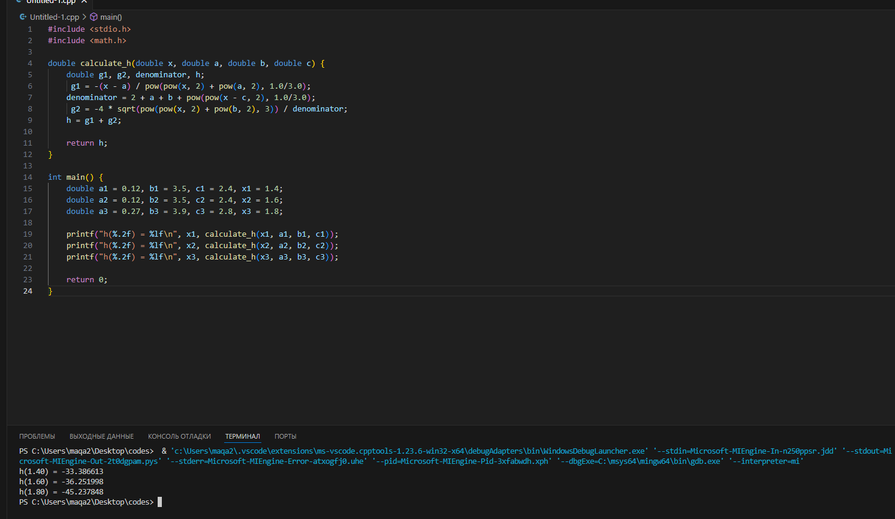

**Задание 2.1**
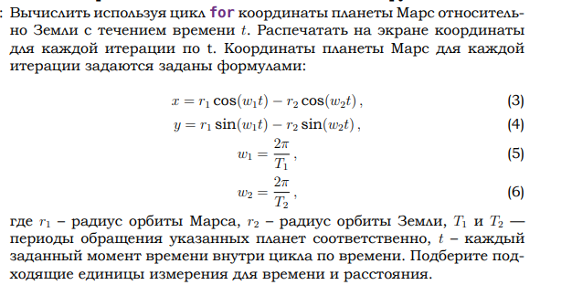

**Список идентификаторов**

| Имя переменной | Тип данных | Описание                                      |
|----------------|------------|-----------------------------------------------|
| r1             | double     | Радиус орбиты Марса в астрономических единицах (AU). |
| r2             | double     | Радиус орбиты Земли в астрономических единицах (AU). |
| T1             | double     | Период обращения Марса в днях.               |
| T2             | double     | Период обращения Земли в днях.               |
| w1             | double     | Угловая скорость Марса: \( w_1 = \frac{2\pi}{T_1} \). |
| w2             | double     | Угловая скорость Земли: \( w_2 = \frac{2\pi}{T_2} \). |
| t              | double     | Время в днях.                                 |
| t_start        | double     | Начальное время (0 дней).                    |
| t_end          | double     | Конечное время (365.25 дней, один год).      |
| dt             | double     | Шаг времени в днях (30 дней).                |
| x              | double     | Координата \( x \) Марса относительно Земли. |
| y              | double     | Координата \( y \) Марса относительно Земли. |

**Код программы**

`#define PI 3.14159265358979323846

int main() {

    double r1 = 1.524;
    double r2 = 1.0;

    double T1 = 687.0;

    double T2 = 365.25;

    double w1 = (2 \* PI) / T1;

    double w2 = (2 \* PI) / T2;

    double t\_start = 0.0;

    double t\_end = 365.25;

    double dt = 30.0;      

    for (double t = t\_start; t <= t\_end; t += dt) {
    
        double x = r1 \* cos(w1 \* t) - r2 \* cos(w2 \* t);
        
        double y = r1 \* sin(w1 \* t) - r2 \* sin(w2 \* t);

        printf("Время t = %.2f дней:\n", t);

        printf("x = %lf AU\n", x);

        printf("y = %lf AU\n\n", y);

    }

    return 0;

}`

**Результат программы**
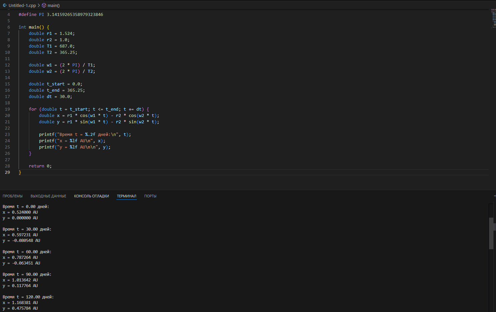

**Задание 2.2**

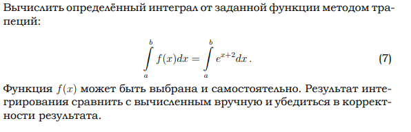
**Список идентификаторов**

| Имя переменной       | Тип данных | Описание                                           |
|----------------------|------------|----------------------------------------------------|
| a                    | double     | Нижний предел интегрирования.                      |
| b                    | double     | Верхний предел интегрирования.                     |
| n                    | int        | Количество разбиений для метода трапеций.          |
| h                    | double     | Шаг разбиения.                                     |
| sum                  | double     | Сумма для вычисления интеграла.                    |
| x                    | double     | Текущая точка на интервале интегрирования.         |
| result               | double     | Результат вычисления интеграла.                    |
| f(x)                 | double     | Функция, для интеграции.                           |
| trapezoidal_integral | double     | Функция для вычисления интеграла методом трапеций. |
| exp(x + 2)           | double     | Экспоненциальная функция.                          |

**Код программы**

`#include <stdio.h>

#include \math.h>

double f(double x) {

    return exp(x + 2);

}

double trapezoidal\_integral(double a, double b, int n) {

    double h = (b - a) / n;

    double sum = 0.5 \* (f(a) + f(b));

    for (int i = 1; i < n; i++) {
    
        double x = a + i \* h;

        sum += f(x);

    }

    return sum \* h;
}

int main() {

    double a, b;

    int n;

    printf("Введите нижний предел интегрирования a: ");

    scanf("%lf", \&a);

    printf("Введите верхний предел интегрирования b: ");

    scanf("%lf", \&b);

    printf("Введите количество разбиений n: ");

    scanf("%d", \&n);

    double result = trapezoidal\_integral(a, b, n);

    printf("Значение интеграла: %lf\n", result);

    return 0;

}`

**Результат работы**
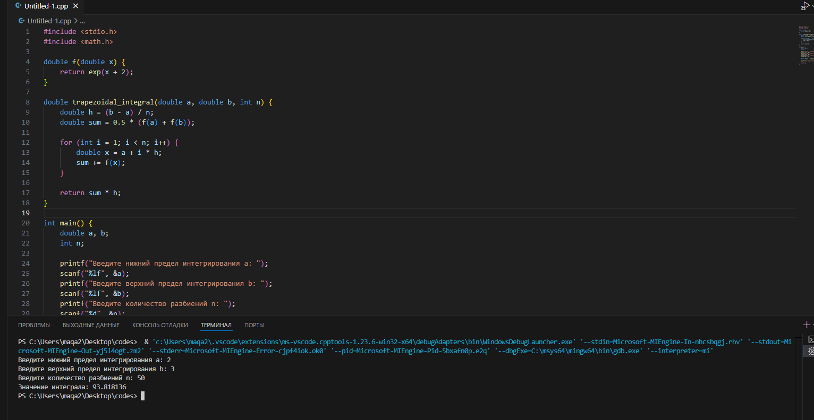

**Задание 2.3**
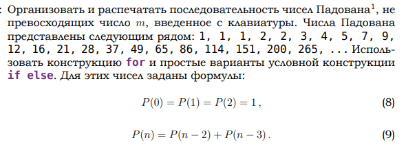

**Список идентификаторов**

| Имя переменной | Тип данных | Описание                                      |
|----------------|------------|-----------------------------------------------|
| m              | int        | Верхний предел для чисел Падована (вводится пользователем). |
| P              | int[]      | Массив для хранения чисел Падована.           |
| n              | int        | Индекс текущего числа Падована.              |
| P[0]           | int        | Первое число Падована: \( P(0) = 1 \).       |
| P[1]           | int        | Второе число Падована: \( P(1) = 1 \).       |
| P[2]           | int        | Третье число Падована: \( P(2) = 1 \).       |
| P[n]           | int        | Текущее число Падована: \( P(n) = P(n-2) + P(n-3) \). |

**Код программы**

`\#include \<stdio.h>

\

int main() {

    int m;

    printf("Введите верхний предел m: ");

    scanf("%d", \&m);

\

    int P\[1000];

    P\[0] = 1;

    P\[1] = 1;

    P\[2] = 1;

\

    printf("Числа Падована, не превосходящие %d:\n", m);

    if (P\[0] <= m) printf("%d ", P\[0]);

    if (P\[1] <= m) printf("%d ", P\[1]);

    if (P\[2] <= m) printf("%d ", P\[2]);

\

    for (int n = 3; ; n++) {

        P\[n] = P\[n - 2] + P\[n - 3];

        if (P\[n] > m) break;

        printf("%d ", P\[n]);

    }

\

    printf("\n");

    return 0;

**Результат программы**
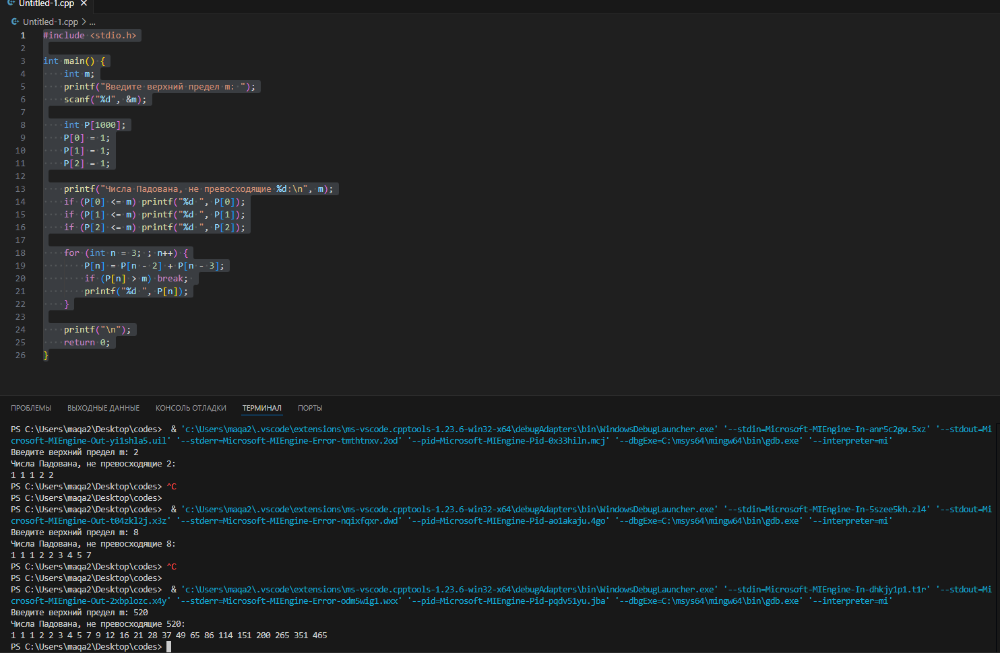

**Задание 2.4**
С клавиатуры вводится трёхзначное число, считается сумма его цифр. Если сумма цифр числа больше 10, то вводится следующее трёхзначное число, если сумма меньше либо равна 10 — программа завершается.

**Список идентификаторов**

| Имя переменной | Тип данных | Описание                                      |
|----------------|------------|-----------------------------------------------|
| number         | int        | Введенное трехзначное число.                 |
| sum            | int        | Сумма цифр числа.                            |
| number / 100   | int        | Первая цифра числа (сотни).                  |
| (number / 10) % 10 | int   | Вторая цифра числа (десятки).                |
| number % 10    | int        | Третья цифра числа (единицы).                |

**Код программы**

`\#include \<stdio.h>

int main() {

    int number, sum;
    
    while (1) {

        printf("Введите трехзначное число: ");

        scanf("%d", \&number);
        
        if (number < 100 || number > 999) {

            printf("Ошибка: число должно быть трехзначным.\n");

            continue;

        sum = (number / 100) + ((number / 10) % 10) + (number % 10);

        printf("Сумма цифр числа %d равна %d\n", number, sum);

        if (sum <= 10) {

            printf("Сумма цифр меньше или равна 10. Программа завершена.\n");

            break;

        }

    }

    return 0;
}`

**Результат программы**
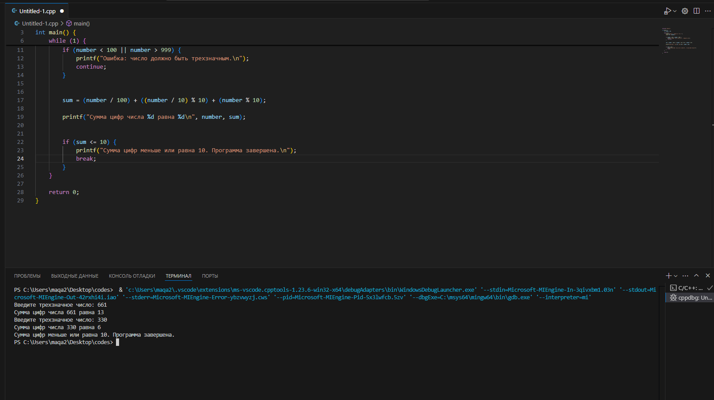

