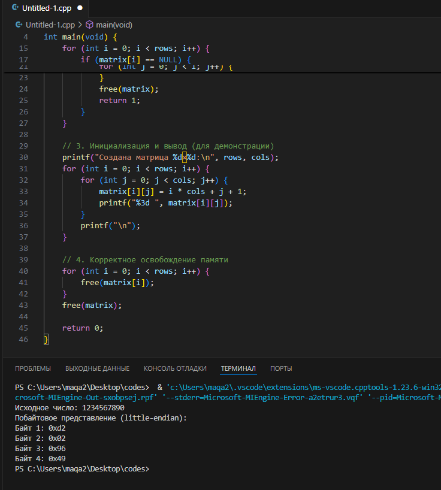

# Лабораторная работа 2 - Указатели, арифметика указателей

## Задача 1 - Многоуровневые указатели

### Постановка задачи
Определить указатель double ***pointer = NULL; и инициализировать его адресом другого указателя типа double **, который указывает на переменную double *, которая указывает на double. Записать значение 2.0 в сегмент оперативной памяти для double.

### Математическая модель
pointer → double** → double* → double (2.0)

### Список идентификаторов
| Имя переменной | Тип данных | Описание |
|----------------|------------|----------|
| pointer        | double***  | Трехуровневый указатель |
| ptr2           | double**   | Указатель на указатель |
| ptr1           | double*    | Указатель на double |
| value          | double     | Хранимое значение |

### Код программы
```c
#include <stdio.h>
#include <stdlib.h>

int main(void) {
    double ***pointer = NULL;
    pointer = (double***)malloc(sizeof(double**));
    *pointer = (double**)malloc(sizeof(double*));
    **pointer = (double*)malloc(sizeof(double));
    ***pointer = 2.0;
    
    printf("Значение: %.1f\n", ***pointer);
    
    free(**pointer);
    free(*pointer);
    free(pointer);
    return 0;
}
````

**Результат программы**


## Задача 2 - Сложение двух чисел через указатели

### Постановка задачи
Написать программу, которая складывает два числа с использованием указателей на эти числа.

### Список идентификаторов
| Имя переменной | Тип данных | Описание          |
|----------------|------------|-------------------|
| a              | int        | Первое число      |
| b              | int        | Второе число      |
| pa             | int*       | Указатель на a    |
| pb             | int*       | Указатель на b    |

### Код программы
```c
#include <stdio.h>

int main(void) {
    int a = 5, b = 3;
    int *pa = &a, *pb = &b;
    
    printf("Сумма %d и %d равна %d\n", *pa, *pb, *pa + *pb);
    return 0;
}
```
**Результат программы**


 
## Задача 3 - Нахождение максимума из двух чисел через указатели

### Постановка задачи
Написать программу, которая находит максимальное из двух чисел, используя указатели на эти числа.

### Математическая модель
max = (a > b) ? a : b\
где a и b - входные числа


### Список идентификаторов
| Имя переменной | Тип данных | Описание                  |
|----------------|------------|---------------------------|
| num1           | int        | Первое число для сравнения|
| num2           | int        | Второе число для сравнения|
| p1             | int*       | Указатель на num1         |
| p2             | int*       | Указатель на num2         |
| maximum        | int        | Результат сравнения       |

### Код программы
```c
#include <stdio.h>

int main(void) {
    int num1 = 15, num2 = 8;
    int *p1 = &num1, *p2 = &num2;
    int maximum = (*p1 > *p2) ? *p1 : *p2;
    
    printf("Максимальное число между %d и %d: %d\n", *p1, *p2, maximum);
    return 0;
}
```
**Результат программы**


## Задача 4 - Динамический массив с плавающей точкой

### Постановка задачи
Создать одномерный динамический массив из чисел с плавающей точкой двойной точности, заполнить его значениями с клавиатуры и вывести все элементы, используя арифметику указателей (без оператора []).

### Математическая модель
Для массива arr размером n:\
arr → \[double1, double2, ..., doublen]\
Доступ через \*(arr + i), где i ∈ \[0, n-1]


### Список идентификаторов
| Имя переменной | Тип данных | Описание                  |
|----------------|------------|---------------------------|
| size           | int        | Размер массива            |
| arr            | double*    | Указатель на массив       |
| ptr            | double*    | Текущий указатель         |
| i              | int        | Счетчик элементов         |

### Код программы
```c
#include <stdio.h>
#include <stdlib.h>

int main(void) {
    int size;
    printf("Введите размер массива: ");
    scanf("%d", &size);

    // Выделение памяти
    double *arr = (double*)malloc(size * sizeof(double));
    if (arr == NULL) {
        printf("Ошибка выделения памяти!\n");
        return 1;
    }

    // Ввод элементов
    printf("Введите %d элементов массива:\n", size);
    for (double *ptr = arr; ptr < arr + size; ptr++) {
        scanf("%lf", ptr);
    }

    // Вывод элементов
    printf("Элементы массива:\n");
    for (double *ptr = arr; ptr < arr + size; ptr++) {
        printf("%.2f ", *ptr);
    }

    // Освобождение памяти
    free(arr);
    return 0;
}
```
**Результат программы** 


## Задача 5 - Обратный порядок элементов массива

### Постановка задачи
Вывести элементы динамического массива целых чисел в обратном порядке, используя указатель и операцию декремента.

### Математическая модель
Для массива arr размером n:\
Обратный порядок: arr\[n-1], arr\[n-2], ..., arr\[0]\
Доступ через \*(arr + i), где i уменьшается от n-1 до 0


### Список идентификаторов
| Имя переменной | Тип данных | Описание                  |
|----------------|------------|---------------------------|
| size           | int        | Размер массива            |
| arr            | int*       | Указатель на массив       |
| ptr            | int*       | Текущий указатель         |
| i              | int        | Счетчик элементов         |

### Код программы
```c
#include <stdio.h>
#include <stdlib.h>

int main(void) {
    int size;
    printf("Введите размер массива: ");
    scanf("%d", &size);

    // Выделение памяти
    int *arr = (int*)malloc(size * sizeof(int));
    if (arr == NULL) {
        printf("Ошибка выделения памяти!\n");
        return 1;
    }

    // Ввод элементов
    printf("Введите %d целых чисел:\n", size);
    for (int i = 0; i < size; i++) {
        scanf("%d", arr + i);
    }

    // Вывод в обратном порядке
    printf("Массив в обратном порядке:\n");
    for (int *ptr = arr + size - 1; ptr >= arr; ptr--) {
        printf("%d ", *ptr);
    }

    // Освобождение памяти
    free(arr);
    return 0;
} 
```

**Результат программы** 


## Задача 6 - Побайтовый вывод переменной

### Постановка задачи
Определить переменную целого типа `int a = 1234567890` и вывести побайтово её содержимое на экран, используя указатель типа `char*`.

### Математическая модель
Для переменной a типа int (4 байта):\
Байты: \[byte1]\[byte2]\[byte3]\[byte4]\
Доступ через \*(char\_ptr + i), где i ∈ \[0, sizeof(int)-1]


### Список идентификаторов
| Имя переменной | Тип данных | Описание                  |
|----------------|------------|---------------------------|
| a              | int        | Исходное число            |
| byte_ptr       | char*      | Указатель для доступа к байтам |
| i              | size_t     | Счетчик байтов            |

### Код программы
```c
#include <stdio.h>
#include <stddef.h>

int main(void) {
    int a = 1234567890;
    char *byte_ptr = (char*)&a;
    
    printf("Исходное число: %d\n", a);
    printf("Побайтовое представление (little-endian):\n");
    
    for(size_t i = 0; i < sizeof(int); i++) {
        printf("Байт %zu: 0x%02x\n", i+1, (unsigned char)byte_ptr[i]);
    }
    
    return 0;
}
```


**Результат работы**


## Задача 7 - Двумерный динамический массив

### Постановка задачи
Выделить память под двумерный динамический массив, используя массив указателей на строки, и корректно освободить память.

### Математическая модель
Для матрицы размером rows×cols:

1. Выделить массив указателей: row\_ptrs\[rows]

2. Для каждого row\_ptrs\[i] выделить массив из cols элементов

3. Освобождение в обратном порядке


### Список идентификаторов
| Имя переменной | Тип данных | Описание                  |
|----------------|------------|---------------------------|
| rows           | int        | Количество строк          |
| cols           | int        | Количество столбцов       |
| matrix         | int**      | Указатель на массив указателей |
| i              | int        | Счетчик строк             |

### Код программы
```c
#include <stdio.h>
#include <stdlib.h>

int main(void) {
    int rows = 3, cols = 4;
    
    // 1. Выделение памяти для массива указателей на строки
    int **matrix = (int**)malloc(rows * sizeof(int*));
    if (matrix == NULL) {
        printf("Ошибка выделения памяти для указателей строк\n");
        return 1;
    }

    // 2. Выделение памяти для каждой строки
    for (int i = 0; i < rows; i++) {
        matrix[i] = (int*)malloc(cols * sizeof(int));
        if (matrix[i] == NULL) {
            printf("Ошибка выделения памяти для строки %d\n", i);
            
            // Освобождаем уже выделенную память при ошибке
            for (int j = 0; j < i; j++) {
                free(matrix[j]);
            }
            free(matrix);
            return 1;
        }
    }

    // 3. Инициализация и вывод (для демонстрации)
    printf("Создана матрица %d×%d:\n", rows, cols);
    for (int i = 0; i < rows; i++) {
        for (int j = 0; j < cols; j++) {
            matrix[i][j] = i * cols + j + 1;
            printf("%3d ", matrix[i][j]);
        }
        printf("\n");
    }

    // 4. Корректное освобождение памяти
    for (int i = 0; i < rows; i++) {
        free(matrix[i]);
    }
    free(matrix);

    return 0;
}
```
**Результат программы**

